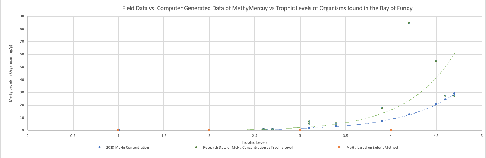
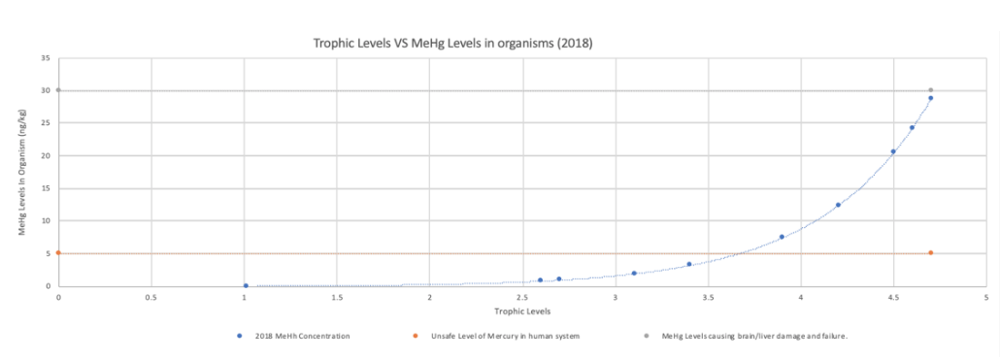

# Instructions

Intro to Computer Programming

Alexandra Matos and Matthew Williams

Wednesday, May 22nd, 2019

# Instructions to Creating Result Graphs

## Graph 1: Comparing our results to results of journal

### Step 1:

Run *BiomagnificationTermProject.java* (found in **Data Folder**)

### Step 2: 

Copy results from loop 1 to excel. Plot trophic level on X-Axis and MeHg Levels (in ng/g) on y - axis

Copied results should look like this:

| Tropic Level  | MeHg Concentrations (in ng/g)|
| ------------- |:-------------:|
| 1.01          | 0.057518938406336|
| 1.01          | 0.057518938406336|
| 2.6           | 0.836741563      |
| 2.7           | 0.990198331     |
| 2.7           | 0.990198331     |
| 3.4           | 3.21838595663203 |
| 3.1           | 1.941983703|
| 3.9           | 7.469514309      |
| 4.6           |24.2777423560867      |
| 4.7           | 28.7302328630565 |
| 4.5           | 20.5152800785835|
| 4.2           | 12.3789813031645      |

### Step 3

From results found through running *BiomagnificationTermProject.java*, plot the data points of the average MeHg at each trophic level (This serves as a comparison to the experimental values, there is no way of estimating the % error). Plot these values on the same graph using *ADD DATA VALUES* option

Copied results should look like this:

| Tropic Level  | MeHg Concentrations (in ng/g)|
| ------------- |:-------------:|
| 1             | 0|
| 2             | 0      |
| 2             | 0     |
| 4             | 0 |

### Step 4

On the same graph, plot results found from the scientific paper **- *Bioaccumulation of methylmercury within the marine food web of the outer Bay of Fundy, Gulf of Maine* by Gareth Harding, John Dalziel, and Peter Vass.**

Use these values

| Tropic Level  | MeHg Concentrations (in ng/g)|
| ------------- |:-------------:|
| 1          | 0.09|
| 1           | 0.05     |
| 2.6           | 0.4   |
| 3.7           | 0.5 |
| 3.4           | 5.1|
| 3.1           |5.3      |
| 4.1           |6.9    |
| 4.9           | 17.4 |
| 4.2           | 83.9|
| 4.5           | 54.6      |
| 4.7           | 27.1 |
| 4.6           |  27.1|

## Graph 2: Toxicity in Humans 

### Step 1

Run *BiomagnificationTermProject.java* (found in **Data Folder**)

### Step 2

Copy results from loop 1 to excel. Plot trophic level on X-Axis and MeHg Levels (in ng/g) on y - axis

Copied results should look like this:

| Tropic Level  | MeHg Concentrations (in ng/g)|
| ------------- |:-------------:|
| 1.01          | 0.057518938406336|
| 1.01          | 0.057518938406336|
| 2.6           | 0.836741563      |
| 2.7           | 0.990198331     |
| 2.7           | 0.990198331     |
| 3.4           | 3.21838595663203 |
| 3.1           | 1.941983703|
| 3.9           | 7.469514309      |
| 4.6           |24.2777423560867      |
| 4.7           | 28.7302328630565 |
| 4.5           | 20.5152800785835|
| 4.2           | 12.3789813031645      |

### Step 3 

On the same graph, plot the line at which MeHg levels within organisms is considered *harmful* to humans

Use the values:

| Tropic Level  | Harmful MeHg Levels to humans (in ng/g)|
| ------------- |:-------------:|
|0        | 5|
|4.7       |5|

### Step 4 

On the same graph, plot the line at which MeHg levels within organisms is considered *toxic* to humans

Use the values:

| Tropic Level  | Harmful MeHg Levels to humans (in ng/g)|
| ------------- |:-------------:|
|0        | 30|
|4.7       |30|
