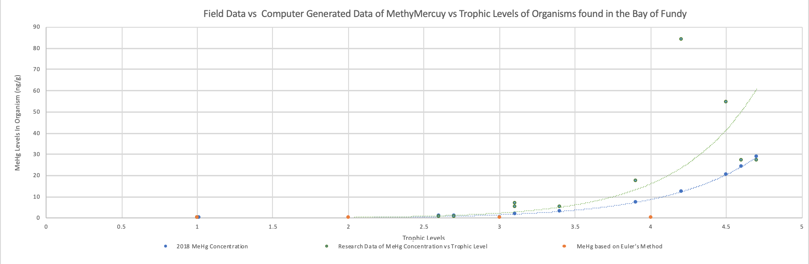

# Report
<pre>
Intro to Computer Programming

Alexandra Matos and Matthew Williams

Wednesday, May 22nd, 2019
</pre>
# Instructions to Creating Result Graphs

## Graph 1: Comparing our results to results of journal

### Step 1:

Run *BiomagnificationTermProject.java* (found in **Data Folder**

### Step 2: 

Copy results from loop 1 to excel. Plot trophic level on X-Axis and MeHg Levels (in ng/kg) on y - axis

Copied results should look like this:

| Tropic Level  | MeHg Concentrations (in ng/Kg)|
| ------------- |:-------------:|
| 1.01          | right-aligned |
| 2.6           | centered      |
| 2.7           | are neat      |
| 3.4           | right-aligned |
| 3.1           | right-aligned |
| 3.9           | centered      |
| 4.6           | are neat      |
| 4.7           | right-aligned |
| 4.5           | centered      |
| 4.2           | are neat      |
