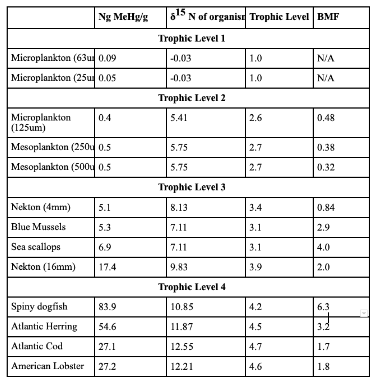

# Report
<pre>
Intro to Computer Programming

Alexandra Matos and Matthew Williams

Wednesday, May 22nd, 2019
</pre>
# Biomagnification of MeHg through trophic levels in the Bay of Fundy

### Introduction

For our term project, we decided to study the effects of methylmercury (MeHg) biomagnification through different trophic levels of marine animals located in the Bay of Fundy. Due to the large surface area of certain aquatic organisms such as phytoplankton, MeHg, a compound of Mercury, is easily absorbed and subsequently transferred up the trophic chain through prey consumption and/or female to offspring transfer. Furthermore, MeHg is also more easily transferable up the trophic chain than inorganic mercury. Seeing as though the consumption of fish and seafood amongst humans is at an all-time high, we decided to ask the question: what initial amount of MeHg in a primary producer would eventually lead -- through biomagnification -- to human neurotoxicity if consumed? By using the trophic levels of different organisms, their average mass, amount consumed, as well as birth and death rates all while taking account the total magnification factor (dependent on their zone), we plan to computationally calculate the amount of bioaccumulated MeHG in organisms of the highest trophic order.

###  Test case

The values of this computational model are based on the research article “Bioaccumulation of methylmercury within the marine food web of the outer Bay of Fundy, Gulf of Maine” by Gareth Harding, John Dalziel, and Peter Vass. The scientific paper discusses the relationship between different trophic levels, size of organisms within the trophic levels and most importantly, the concentration of methylmercury (MeHg) found in the organisms. 

In our project, we look to duplicate the final results through differential equations. This model can be applied to instances in which methylmercury has been introduced into an ecosystem and is transferred between organisms of different trophic levels through predator to prey consum

### Description of Model

Seeing as though the foundation of this term project is based on the Methylmercury levels in the bay of fundy, the following equation will be used to account for the slow but constant increase in the toxin levels due to outer sources (fossil fuels, mining, etc.)

 
 
 
 Primary producers such as plankton and phytoplankton are able to absorb and adsorb the MeHg found in their surrounding aquatic environment. Therefore, we must take into account their size to volume ratio which in turn relates to the total amount of MeHg that can be held within their system. The following equation is used:

 

In order to calculate the final measurement of biomagnification within the organisms, we must first calculate the trophic levels of organisms. Using the δ15N of the organism (found in studies), we use the following equation to calculate the trophic level:

By using the experimental isotopic biomagnification factor found in “Bioaccumulation of methylmercury within the marine food web of the outer Bay of Fundy, Gulf of Maine”, the following formula is used to calculate the biomagnification through trophic levels.

 

### The science behind the biomagnification of Mercury and its compounds.

Mercury is a chemical element that exists in many forms. While this element can occur naturally, the post-industrial revolution era has caused a rise in its levels throughout our environment. Currently, our aquatic ecosystems are suffering due to the abnormal amount of mercury (and it’s compound forms) seeping into lakes, rivers and oceans.

#### *How mercury is accumulated in the environment?*

There are three main ways Mercury is introduced into an environment. Mercury can be released into the environment through natural occurrences, such as volcanoes, forest fires and the weathering of rocks. Mercury can also be released into the environment through non-natural sources, mainly the mining and burning of fossil fuels. Finally, mercury also experiences a cyclic reintroduction into the environment through the vaporization and condensation of water.  

When a compound of mercury enters an ecosystem, it is absorbed or adsorbed by an organism. This organism becomes a carrier of the element and can transfer it to other organisms through prey consumption as well as transfer from mother to offspring.

#### *The difference between absorption and adsorption*

**Absorption** is a process in which a substance is gradually accumulated within another substance or organism. This process occurs at a uniform rate and maintains a stable concentration throughout the material. Temperature does not affect this process.  

**Adsorption** is a process in which a substance accumulates at the surface of another substance or organism. Unlike absorption, adsorbed substances remain only on the exterior of another surface. This rate of this process slowly increases until equilibrium is reached. Furthermore, low temperature does affect the rate of reaction.

#### *The difference between biomagnification and bioaccumulation*
 
**Biomagnification** describes the large increase in the concentration of mercury between trophic levels. This gap is created by the prey (in the lower trophic level) being consumed by the predators (residing in the upper levels). As the predators consume the prey, they also ingest their mercury, thus increasing their concentration of mercury with every bite. 

**Bioaccumulation** occurs mainly at the first and second trophic levels, where primary producers are exposed to substances like mercury and they ingest it either through absorption or adsorption. 

### Description of Computational Method
Description of Computational Method

In order to simulate biomagnification through organisms of different trophic levels, numerical methods were used. The constants used within the equations were taken from real-life data documented by scientific papers. The initial levels of MeHg were calculated through the use of a simple system of equations.  By taking into account the initial MeHg levels in the bay of Fundy area pre-industrial revolution, an equation calculating the final MeHg concentration was built using the time (in years) as the variable. 

 

To begin, a differential equation is used to 
calculate the final level of Methylmercury found in the water. We include this calculated value in the next differential equation: the measurement of the amount of MeHg (in nm/kg) in primary producers, specifically micro and macro-plankton. The following formula is used to calculate the trophic levels based on the experimental isotopic biomagnification levels. 

Next, we used Euler’s method is used to calculate an estimate of the MeHg levels at each trophic level of this ecosystem. Using a modified SIR model, we were able to generate estimations of the concentration of MeHg at each trophic level. Using this data, we plotted a trophic level vs MeHg graph and got the equation describing the exponential relationship between the increase in trophic level and the rapid increase in MeHg concentration.

We can then use the formula seen below that we found in our research to determine the expected trophic level for each organism in our test set, using only the concentration of the Nitrogen 15 isotope found in them. Then we can plug the trophic level values for each individual organism into the exponential function we derived from our Euler’s method to find their estimated MeHg concentration. Now we have values derived from our model for the concentration of MeHg for each organism, and all we needed was the N15 

### Results

### Discussion
